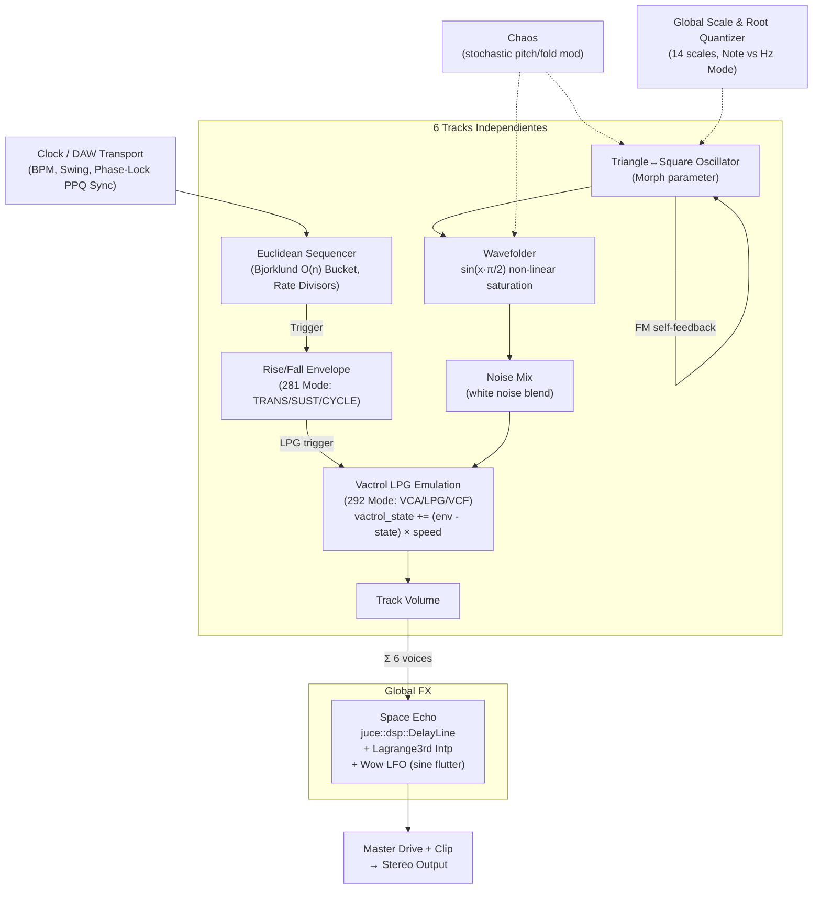

# 🔬 ARQUITECTURA DSP — ÓRBITA-LPG

## Flujo de señal completo



## Algoritmo de Bjorklund (Euclidean)

```
pattern = [0] × steps
bucket = 0
for i in 0..steps:
    bucket += pulses
    if bucket >= steps:
        bucket -= steps
        pattern[(i + offset) % steps] = 1
```

Complejidad: **O(n)** — eficiente para bloques de audio en tiempo real.

## Emulación del Vactrol LPG

El Vactrol físico es un LED + fotoresistencia. Al aumentar el LED (trigger), la LDR tarda en reaccionar (inercia óptica). Al bajar el LED, la LDR tarda aún más en oscurecerse. Este comportamiento asimétrico produce los sonidos percusivos únicos de madera y agua del Buchla.

Modelado digital:
```cpp
float speed_open  = resp * 0.5f;          // rápido al abrir
float speed_close = 0.05f + resp * 0.2f;  // lento al cerrar
float speed = (env > lpg_state) ? speed_open : speed_close;
lpg_state += (env - lpg_state) * speed;
output = signal * lpg_state;
```

El parámetro `Resp` (0.05–1.0) controla ambas velocidades proporcionalmente, permitiendo simular desde Vactrols muy lentos (0.05) hasta VCAs prácticamente instantáneos (1.0).

## Space Echo (Delay)

Implementado con `juce::dsp::DelayLine<float>` stereo. El Wow modula el tiempo de delay con un LFO senoidal:
```cpp
delay_samples += sin(sample * 0.0005f) * wow * 20.0f;
```

> **Licencia:** [http://laurorobles.gumroad.com](http://laurorobles.gumroad.com)
