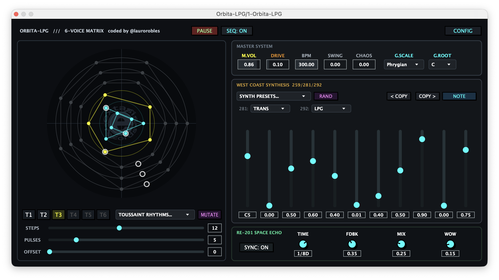

# 🪐 Órbita-LPG

<p align="center">
  
</p>

**Órbita-LPG** is an experimental West Coast synthesizer and 6-track Euclidean sequencer VST3/AU plugin built with JUCE 8.

Each of the 6 independent tracks generates rhythms using the **Bjorklund Euclidean algorithm**, feeds a morphable oscillator through a **Wavefolder + FM** circuit, and shapes the final sound with a physical **Vactrol Low Pass Gate (LPG)** emulation — all synchronized to a built-in clock or your DAW's transport. A **Space Echo** with Wow/Flutter gives life to the output.

> 🔑 **License:** GPLv3 (Open Source)
> 🏷️ **Developer:** Extasis Records / Lauro Robles

---

## Features

- **6 independent Euclidean tracks** — Steps, Pulses, Offset, Rate divisor per track
- **West Coast synthesis per track** — Triangle↔Square morph, Wavefolder, FM feedback, Pitch Drop
- **Vactrol LPG emulation** — Rise, Fall, and Vactrol Response (Resp) parameters
- **Global Chaos** — stochastic micro-modulation of pitch and fold per voice
- **Global Scale & Root Quantizer** — Lock your pitch globally across all Note-enabled tracks
- **Note vs Hz Mode** — Switch between locked musical scale quantization or fluid Hz sweeping
- **Space Echo with Wow/Flutter** — time-based delay with analog tape flutter simulation (Lagrange3rd interpolation)
- **2X Oversampling** — high-fidelity sound processing eliminating digital aliasing
- **DAW Automation Ready** — Fully mappable with Gestures enabled
- **6 individual stereo outputs** + Master output (multi-bus)
- **DAW sync** + internal BPM + Swing
- **Formats:** VST3 · AU · Standalone (macOS, Windows, Linux)

---

## Installation / Build

We provide automated multi-platform builds using GitHub Actions. Check the **Releases** tab to download the compiled VST3/AU binaries for macOS, Windows, and Linux.

If you prefer building from source using CMake:

```bash
git clone https://github.com/YourUsername/OrbitaLPG.git
cd OrbitaLPG
cmake -B build -DCMAKE_BUILD_TYPE=Release
cmake --build build --config Release
```

## License

This software is licensed under the **GPLv3 License**. See the `LICENSE` file for more details.
